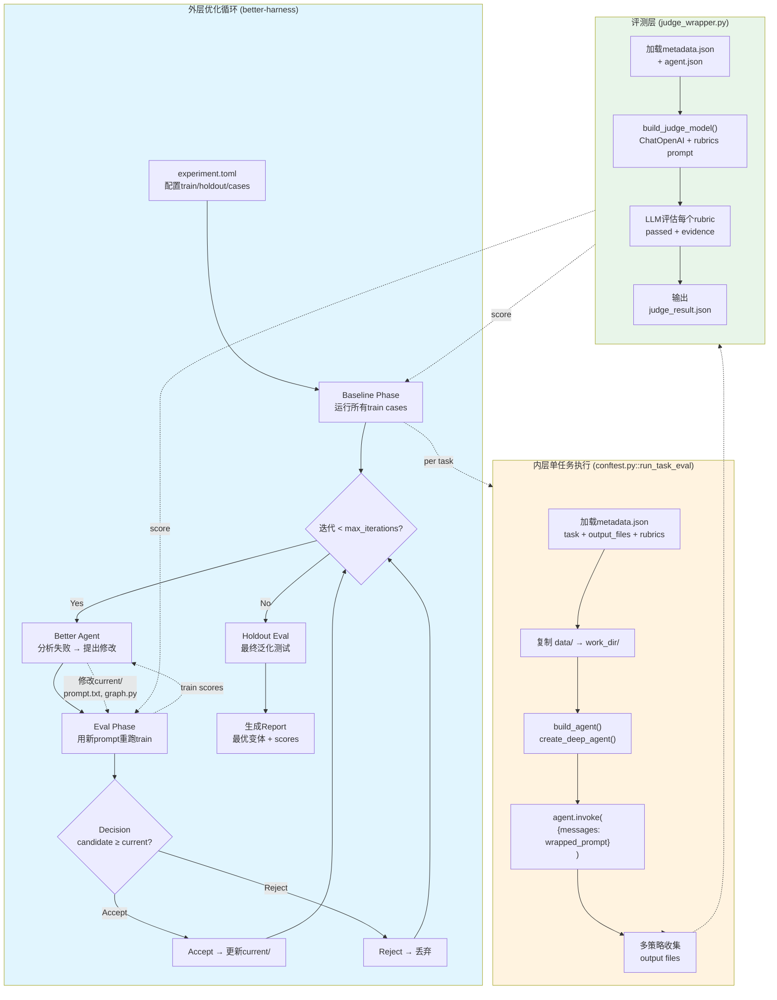
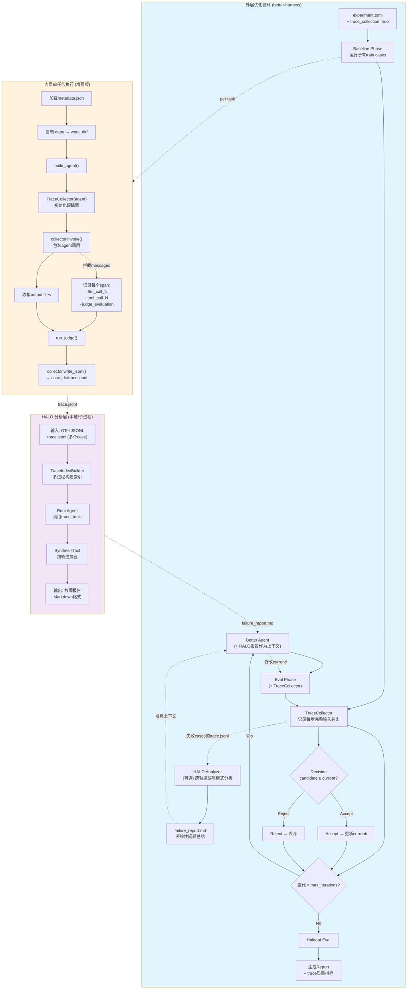
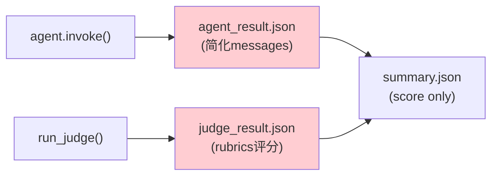
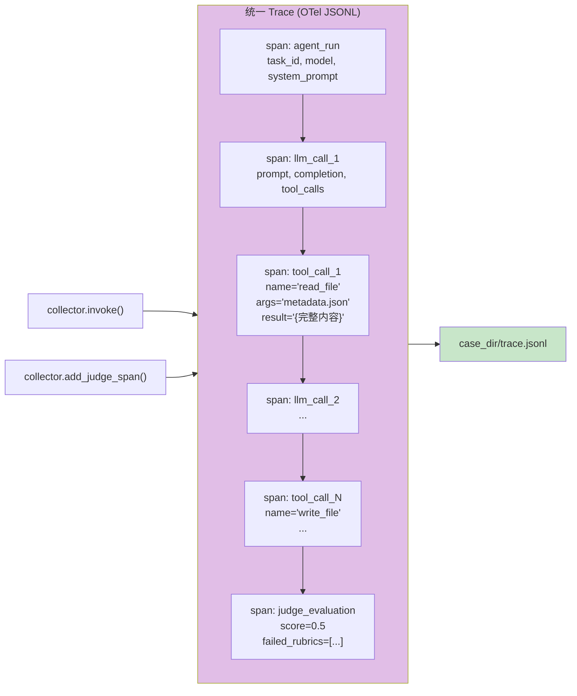
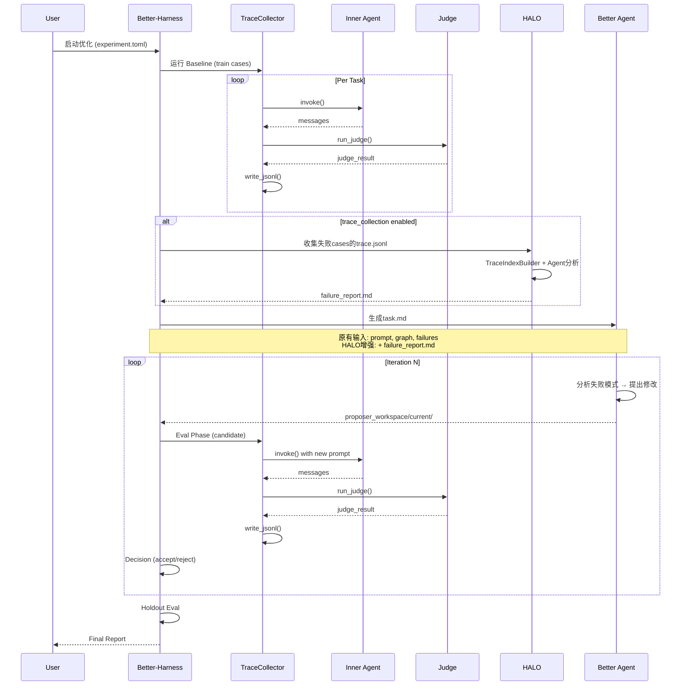
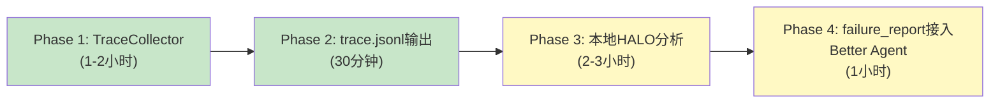

# Better-Harness + Workspace-Bench 流程图

---

## 图1：现有系统（不含 HALO）

### 数据流详解

| 阶段 | 输入 | 输出 | 关键文件 |
|------|------|------|---------|
| **Baseline/Eval** | task_id, data/, metadata.json | work_dir/, agent_result.json | `summary.json`, `judge_result.json` |
| **Better Agent** | current/prompt.txt, current/graph.py, task.md, train_failures.json | 修改后的 prompt/graph | `proposer_workspace/current/` |
| **Judge** | metadata.json, output/, agent.json | rubric-level评分 | `judge_result.json` |

---

## 图2：加入 HALO 后的增强系统

### 关键增强点

| 组件 | 新增能力 | 解决的问题 |
|------|---------|-----------|
| **TraceCollector** | 每步 LLM/Tool/Judge 记录为 OTel span | "无法定位是agent还是tool出错" |
| **trace.jsonl** | 完整 tool input/output + 时序 + 错误堆栈 | agent_result.json 数据截断、缺失 |
| **HALO Analyzer** | 跨 case 的系统性模式识别 | 单 case 看不出共性，Better Agent 只能试错 |
| **failure_report.md** | 结构化故障报告（含trace_id、证据、建议） | Better Agent 输入质量低，修改方向盲目 |

---

## 图3：单 Case 的详细数据流（对比）

### 现有系统：单 Case 输出

**问题**：
- `agent_result.json` 只有 `content` 摘要，**没有 tool 完整参数和返回**
- `judge_result.json` 只有评分结果，**无法回溯 agent 哪一步行为导致失败**
- 两个文件是**割裂的**，没有统一 trace_id 关联

### HALO 增强后：单 Case 输出

**优势**：
- **统一 trace_id** 贯穿 agent_run → llm_calls → tool_calls → judge
- **完整 tool 结果** 保存在 `tool_call_N` span 的 `result` 属性
- **时序信息** 每个 span 有 `start_time`/`end_time`，可定位超时
- **错误保留** agent 异常时 `agent_completion` span 记录 `error_type` + `error_message`

---

## 图4：HALO 分析在优化循环中的位置

---

## 实施优先级

| 阶段 | 产出 | 价值 |
|------|------|------|
| **Phase 1-2** | 每个 case 有 `trace.jsonl` | 立刻可以手动分析单个 case 的完整执行过程 |
| **Phase 3** | `halo trace.jsonl -p "..."` 生成报告 | 跨 case 系统性问题定位 |
| **Phase 4** | Better Agent 自动读取 HALO 报告 | 优化方向从"试错"变为"数据驱动" |
